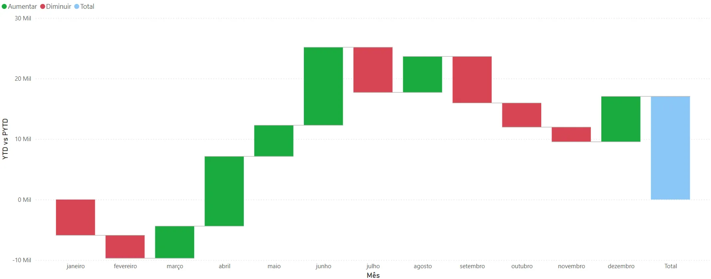

# Performance Report – Sales and KPIs in the Gardening Market


# Context

This project simulates the performance analysis of a **fictional plant and gardening company** between 2022 and 2024.

The goal was to structure the data in a **dimensional model** (fact and dimension tables), create **DAX measures in Power BI** (Sales, Quantity, COGS, Gross Profit, YTD, and PYTD), and develop an **interactive dashboard** that transforms these calculations into **actionable insights** for management.

---

# Objective

Provide a **clear view of the main KPIs for sales and profitability**, enabling directors to:

- Track **year-to-date performance (YTD)**;
- Compare results with the **previous year (PYTD)**;
- Identify **patterns and relevant variations** by country, month, and customer.

In addition to applying **Business Intelligence concepts**, this project also serves as a **practical demonstration of my skills in DAX modeling, data storytelling, and executive dashboard design**.

---

# Data Source

> **Period:** 2022 to 2024  
> 
> **Entity of analysis:** accounts/customers linked to products (via `Account_id`)  
> 
> **Tables used:**  
> 
> - **`Fact Table` (Sales/Invoice):** sales transactions (product, price, date, identifier).  
> - **`Account Table` (Unique Accounts):** customer data (identification and location).  
> - **`Plant Table` (Product Data):** product catalog (family, group, size, type: indoor/outdoor).  

**Key attributes of the tables:**

- `Product_id` Unique product identifier  
- `Sales_USD` Sales value  
- `quantity` Quantity sold  
- `Price_USD` Unit price  
- `COGS_USD` Cost of goods sold  
- `Date_Time` Transaction date  
- `Account_id` Customer identifier  

<aside>
💡

### **Derived variables created for analysis:**

</aside>

- `Sales`  
- `Quantity`  
- `Gross Profit`  
- `COGS` (Cost of Goods Sold)  
- `PYTD` (Prior Year-to-Date)  
  - Sales  
  - Quantity  
  - Gross Profit  
- `YTD` (Year-to-Date)  
  - Sales  
  - Quantity  
  - Gross Profit  

---

# Modeling in DAX

### Basic Indicators

```jsx
Sales = SUM(Fact_sales[Sales_USD])
Quantity = SUM(Fact_sales[Quantity])
COGS = SUM(Fact_sales[COGS_USD])
Gross Profit = [Sales] - [COGS]
```

### Date Table

```jsx
Dim_Date = 
CALENDAR (
    DATE (2022, 1, 1),
    DATE (2024, 12, 31)
)

Inpast = 
VAR lastsalesdate = MAX(Fact_Sales[Date_Time])
VAR lastsalesdatePY = EDATE(lastsalesdate, -12)
RETURN
Dim_Date[Date] <= lastsalesdatePY
```


### Comparative Measures (YTD and PYTD)

These measures allow comparing current performance with the same period of the previous year.

```jsx
PYTD_Sales =
CALCULATE(
    [Sales],
    SAMEPERIODLASTYEAR(Dim_Date[Date]),
    Dim_Date[Inpast] = TRUE()
)

PYTD_Quantity = 
CALCULATE(
    [Quantity],
    SAMEPERIODLASTYEAR(Dim_Date[Date]),
    Dim_Date[Inpast] = TRUE()
)

PYTD_Gross Profit = 
CALCULATE(
    [Gross Profit],
    SAMEPERIODLASTYEAR(Dim_Date[Date]),
    Dim_Date[Inpast] = TRUE()
)
```


I developed **auxiliary tables** with essential values for filters, ensuring cleaner and more intuitive slicers and demonstrating **best practices in Power BI modeling**.


---

# Dashboard

After modeling, I created a **Power BI dashboard** focused on **executive clarity and intuitive navigation**.


---

## Immediate Executive Summary (Top Cards)

> (YTD, YTD vs PYTD Variation, PYTD, and GP%)


<aside>
💡 **Objective:** Display the key KPIs – year-to-date performance (YTD), comparison with the previous year (PYTD), variation, and gross margin (GP%).

</aside>

Helps users gain a **clear and quick overview** of the general situation before diving into details.

---

## Treemap

> (Bottom 10 YTD vs PYTD by Country)


<aside>
💡 **Objective:** Highlight the **countries with the worst relative performance** compared to the previous year.

</aside>

The treemap is useful to show **hierarchy and negative magnitude in a compact space**, enabling easy identification of where the biggest problems lie.

---

## Waterfall Chart

> (YTD vs PYTD by Month)



<aside>
💡 **Objective:** Show **how each month contributed** to the increase or decrease in the YTD compared to the PYTD.

</aside>

The waterfall chart is ideal to visualize **increments and reductions over time**, helping understand **monthly dynamics**.

---

## Columns with Line

> (YTD Value by Month + Line for PYTD Value)


<aside>
💡 **Objective:** Compare the **cumulative monthly volume** with the previous year’s performance.

</aside>

The columns visualize the **YTD by month**, while the line adds a **historical reference (PYTD)**, facilitating temporal comparison.

---

## Scatter Plot (Dispersão)

> (YTD Value vs GP% by Account)


<aside>
💡 **Objective:** Analyze the **relationship between sales volume and gross margin** for each customer/account.

</aside>

The scatter plot reveals **patterns and clusters**, identifying **high-volume accounts with low margins**, and highlighting **opportunities and risks**.

---

# Interactive Dashboard (Power BI)


[PlantCo_Dashboard.pbix](resources/PlantCo_Dashboard.pbix)

---

# Conclusions

The dashboard consolidated **sales information into a single panel**, enabling tracking of **YTD performance**, comparing with the **same previous period (PYTD)**, and assessing **gross margin at various levels of analysis**.  
This allowed identifying **important patterns**, such as **seasonal fluctuations, performance variations across countries, and high-volume customers with reduced margins**.

<aside>
💡 By combining different types of visualizations, the report provides both **immediate executive-level insights** and **detailed data exploration**, turning isolated metrics into a **clear, strategic business view**.

</aside>

---

Thank you for reading!

# About the Author


**Lucas Correa**  
Data Storyteller | Dataviz | Data & BI Analyst  

Curious by nature and passionate about turning data into visual stories.  
Here you will find my data visualization projects, dashboards, and analyses.

Follow me on:

[https://www.linkedin.com/in/correa-lucas/](https://www.linkedin.com/in/correa-lucas/)   
[https://substack.com/@corlcs/posts](https://substack.com/@corlcs/posts)
